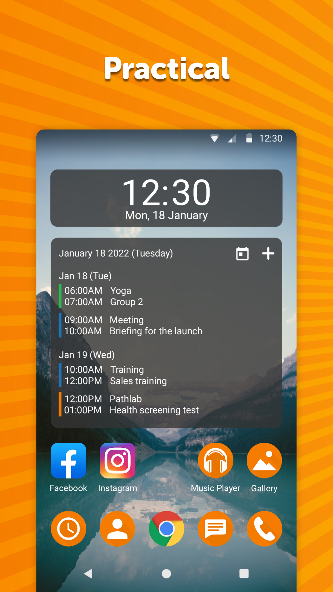
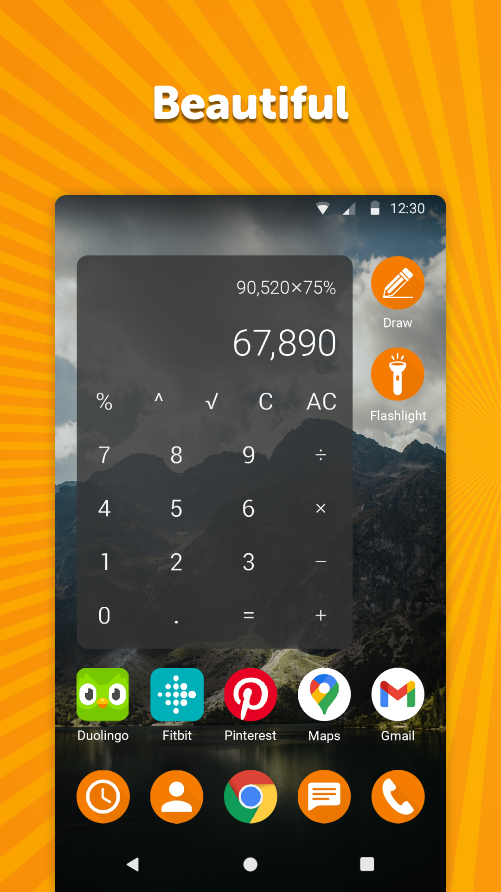
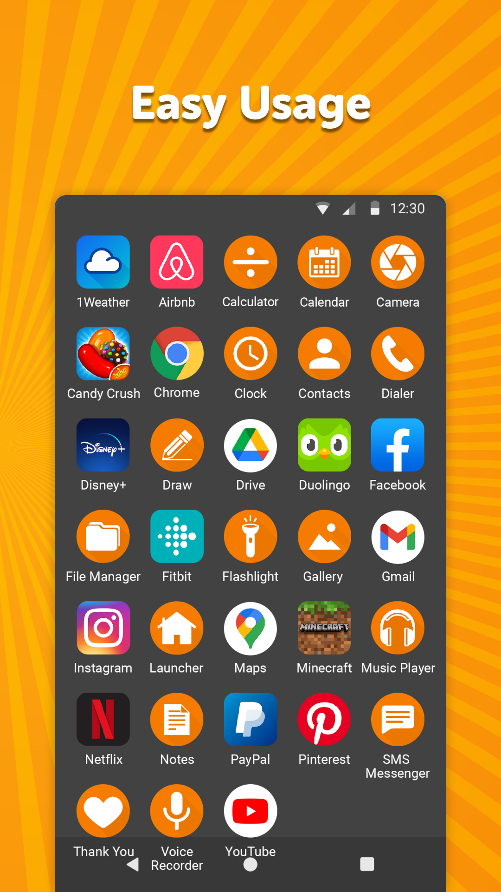

# Simple Launcher

Launch your favorite apps quickly. This app gives you the possibility to customize your home screen as you wish for the best user experience.

You can customize the colors in different styles. This launcher also comes with dark theme to give you a more smooth feel while using your device.

Uninstall any unwanted app easily, so you won't have to keep ignoring it.

It fully supports widgets that can be both resized and customized, so feel free using your favorite widgets here.

It comes with material design and dark theme by default, provides great user experience for easy usage. The lack of internet access gives you more privacy, security and stability than other apps. With this launcher, you don't have to connect your device with any network. Simply install it and use it.

Contains no ads or unnecessary permissions. It is fully opensource, provides customizable colors and dark theme to make your home screen look more stunning. 

Features:

- Dark theme to give you a more smoother feel of your device.
- Easy navigation through the launcher so you can choose the best one for yourself.
- Exquisite color themes.
- No annoying advertisements.
- Enjoy!

<a href="https://f-droid.org/packages/com.simplemobiletools.launcher">Get it on F-Droid</a>

Support us:  
IBAN: SK4083300000002000965231  
Bitcoin: 19Hc8A7sWGud8sP19VXDC5a5j28UyJfpyJ  
Ethereum: 0xB7a2DD6f2408Bce77334655CF5E7639aE31feb30  
Litecoin: LYACbHTKaM9ZubKQGxJ4NRyVy1gHUuztRP  
Bitcoin Cash: qz6dvmhq5vzkcsypxpp2mnur30muxdah4gvulx3y85  
Tether: 0x250f9cC32863E59b87037a14955Ed64F879653F0  
<a href="https://paypal.me/SimpleMobileTools?country.x=SK&locale.x=en_US">PayPal</a>  
<a href="https://www.patreon.com/tiborkaputa">Patreon</a>

